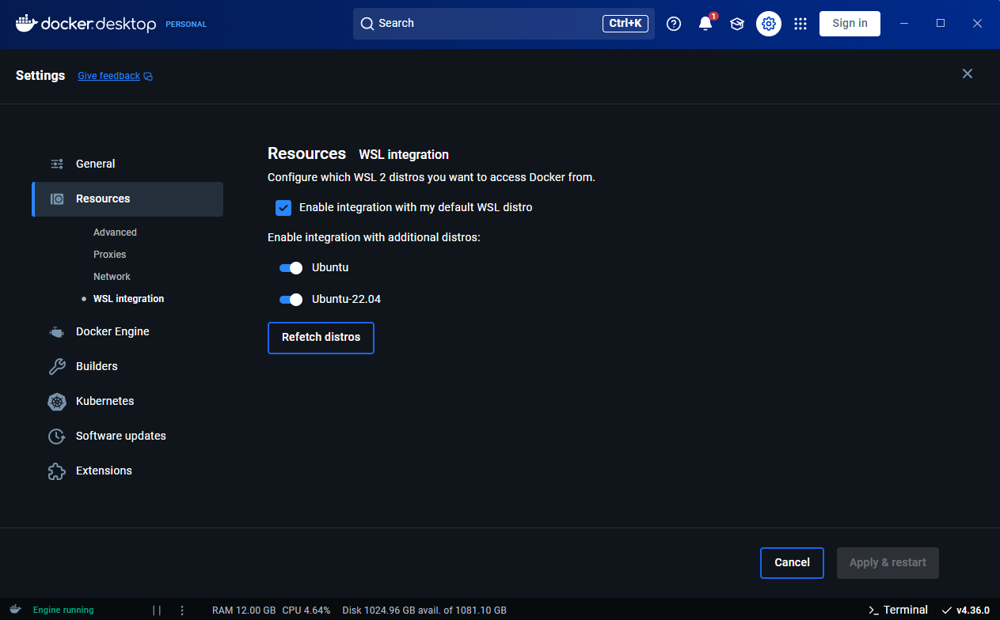

# 🚀 BBB-Translation-Bot

**BBB-Translation-Bot** enhances communication in [BigBlueButton (BBB)](https://bigbluebutton.org/) meetings by providing real-time transcription and translation services. Using OpenAI's [Whisper](https://github.com/openai/whisper) AI, the bot joins a BBB meeting's audio channel to transcribe and translate spoken words into text, seamlessly integrating the transcripts into BBB's closed captions feature. 📝🌐

---

## 🛠️ Getting Started

### 📋 Prerequisites

Before you begin, ensure you have the following:

- **Hardware:**
  - **GPU:** NVIDIA RTX 4090 ([More Info](https://www.nvidia.com/de-de/geforce/graphics-cards/40-series/rtx-4090/)) for stable transcription speeds (~2.1 seconds per English transcription with Whisper large-v3).
  - **Storage:** Minimum 64GB HDD (more recommended for active development as Docker can consume significant disk space).

- **Software:**
  - **Operating System:** Fresh installation of [Ubuntu 22.04](https://releases.ubuntu.com/jammy/) 🐧
  - **Access:** Root access to your machine.

> **Pro Tip:** Consider using [Proxmox](https://www.proxmox.com/) to set up a virtual machine with Ubuntu 22 and enable GPU passthrough. For detailed instructions, check out [README-proxmox.md](README-proxmox.md).

### 📥 Clone the Repository

Don't clone the project in advance. Follow the steps below to set everything up together. 😊

---

## 🔧 Installation

You have two options to set up BBB-Translation-Bot:

1. **Simple Setup**: Quick setup using Docker.
2. **Developer Setup**: Set up a development environment for contributing or customizing.

Choose the one that fits your needs:

- **For Users**: [Simple Setup](#simple-setup-no-dev)
- **For Developers**: [Developer Setup](#developer-setup)

---

### 🚀 Simple Setup (No Development)

Follow these steps to get BBB-Translation-Bot up and running quickly using Docker:

1. **Clone the Repository:**

    ```bash
    git clone https://github.com/bigbluebutton-bot/bbb-translation-bot
    cd bbb-translation-bot
    ```

2. **Run the Makefile:**

    ```bash
    make run
    ```

    This will:

    - Update system packages 🛠️
    - Install NVIDIA drivers 🖥️
    - Reboot the system 🔄
    - Install Docker 🐳
    - Set up Docker with NVIDIA support

> **Note:** The system will reboot automatically. After reboot, the script continues running. To check the status after reboot, run:

```bash
make run
```

3. **Configure the Bot:**

    On the first run, the bot will prompt you to create a `.env` file with your BBB server details:

    - **Domain**: Your BBB server's domain.
    - **BBB Secret**: Retrieve it by SSH into your BBB server and running:

        ```bash
        sudo bbb-conf --secret
        ```

---

### 💻 Developer Setup

If you plan to contribute or customize BBB-Translation-Bot, set up a development environment:

1. **Clone the Repository with Submodules:**

    ```bash
    git clone https://github.com/bigbluebutton-bot/bbb-translation-bot
    cd bbb-translation-bot
    ```

2. **Run the Development Makefile:**

    ```bash
    make run-dev
    ```

    This will:

    - Update system packages 🛠️
    - Install NVIDIA Drivers and CUDA 🖥️💾
    - Reboot the system 🔄
    - Install NVIDIA cuDNN 8.9.7 📚
    - Install Docker 🐳
    - Install GoLang 🛠️
    - Install Python 3 🐍

> **Note:** After reboot, continue the setup by running:

```bash
make run-dev
```

---

## 🪟 Windows WSL Setup

You can also develop on Windows using WSL2. Follow these steps:

1. **Install NVIDIA Drivers on Windows:**

    Download and install from [NVIDIA Drivers](https://www.nvidia.com/en-us/drivers/). According to the [WSL CUDA Guide](https://docs.nvidia.com/cuda/wsl-user-guide/index.html#getting-started-with-cuda-on-wsl), WSL2 will access these drivers.

2. **Install WSL2:**

    Open PowerShell as an administrator and run:

    ```bash
    wsl --install
    ```

3. **Install Ubuntu 22.04:**

    - Open the [Microsoft Store](https://apps.microsoft.com/detail/9pn20msr04dw).
    - Search for **Ubuntu 22.04**.
    - Click **Install** and wait for the installation to complete.

4. **Install Docker Desktop:**

    - Download from [Docker Desktop](https://www.docker.com/products/docker-desktop).
    - Install and enable WSL2 integration.
    - Open the Ubuntu 22.04 terminal and verify Docker by running:

    ```bash
    docker
    ```

    **🔧 Fix Docker Command Not Found Error:**

    <details>
      <summary>Click to expand</summary>

      If you encounter:

      ```bash
      $ docker
      The command 'docker' could not be found in this WSL 2 distro.
      We recommend activating WSL integration in Docker Desktop settings.

      For details, visit:
      https://docs.docker.com/go/wsl2/
      ```

      **Solution:**

      - Open Docker Desktop.
      - Go to **Settings** > **Resources** > **WSL Integration**.
      - Enable integration for **Ubuntu22**.

      

      *Thanks to [this post](https://stackoverflow.com/questions/63497928/ubuntu-wsl-with-docker-could-not-be-found) for the solution.*
    </details>

5. **Clone and Run the Bot:**

    In the Ubuntu 22.04 terminal, execute:

    ```bash
    git clone https://github.com/bigbluebutton-bot/bbb-translation-bot
    cd bbb-translation-bot
    make run-dev
    ```

---

## 📚 Additional Resources

- **Proxmox GPU Passthrough Setup:** [README-proxmox.md](README-proxmox.md)
- **Whisper by OpenAI:** [GitHub Repository](https://github.com/openai/whisper)
- **BigBlueButton:** [Official Website](https://bigbluebutton.org/)

---

## 🙏 Contributing

We welcome contributions! Whether it's reporting issues, suggesting features, or submitting pull requests, your help is greatly appreciated. 🤝

---

## 📝 License

This project is licensed under the [MIT License](LICENSE).

---

## 📫 Contact

For any questions or support, feel free to [open an issue](https://github.com/bigbluebutton-bot/bbb-translation-bot/issues) on GitHub.

---

✨ **Enhance your BBB meetings with real-time transcription and translation!** ✨