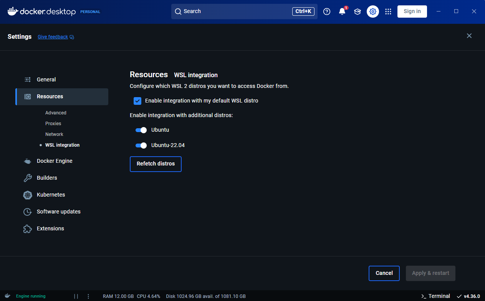

# WSL
## **🔧 Fix Docker Command Not Found Error:**
If you encounter:

```bash
$ docker
The command 'docker' could not be found in this WSL 2 distro.
We recommend activating WSL integration in Docker Desktop settings.

For details, visit:
https://docs.docker.com/go/wsl2/
```

**Solution:**

- Open Docker Desktop.
- Go to **Settings** > **Resources** > **WSL Integration**.
- Enable integration for your distro. In this case, **Ubuntu22**.



*Thanks to [this post](https://stackoverflow.com/questions/63497928/ubuntu-wsl-with-docker-could-not-be-found) for the solution.*